# Hayat Sinyalim

"Hayat Sinyalim", özellikle başta deprem olmak üzere afet sonrası kayıpların tespiti ve kurtarılması amacıyla geliştirilen bir mobil uygulamadır. Afet yönetimi süreçlerini iyileştirmeyi ve insan hayatlarını kurtarmayı hedefler.

## 1. Proje Amacı

"Hayat Sinyalim", doğal afetler sonrasında kayıp kişilerin hızlı bir şekilde tespit edilmesi ve kurtarılması amacıyla tasarlanmış bir mobil uygulamadır. Projenin ana amacı, afetzedelerin yerlerinin tespit edilerek kurtarma ekiplerinin hızlı ve etkili müdahalesini sağlamaktır.

## 2. Çözüm Ürettiği Sorun / İhtiyaç

Doğal afetler, can ve mal kaybına yol açan önemli olaylardır. "Hayat Sinyalim", mobil teknoloji ve GPS izleme sistemlerini kullanarak, afetzedelerin anlık konumlarını takip eden ve kurtarma ekiplerine bu bilgileri sağlayan bir uygulamadır.

## 3. Yöntem ve Hedef Kitle

Uygulama, Android cihazlarda çalışmak üzere geliştirilmiştir ve Firebase Realtime Database kullanarak verilerin güvenli bir şekilde saklanmasını sağlar. Hedef kitle, afet riski yüksek bölgelerde yaşayan bireylerdir.

## 4. Proje Görselleri

Aşağıda proje görselleri yer almaktadır:

| Görsel 1 | Görsel 2 | Görsel 3 |
|----------|----------|----------|
|  | 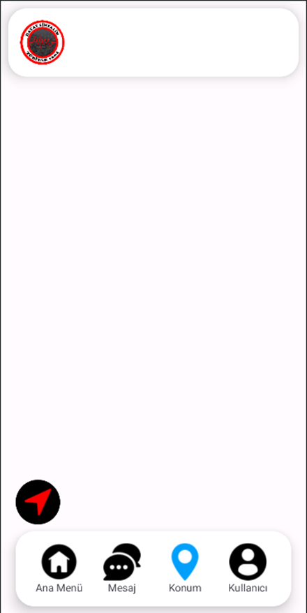 | 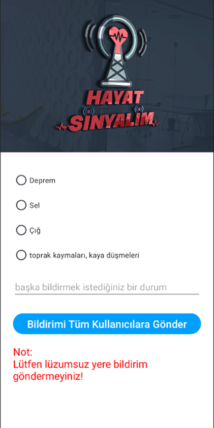 |

| Görsel 4 | Görsel 5 | Görsel 6 |
|----------|----------|----------|
| 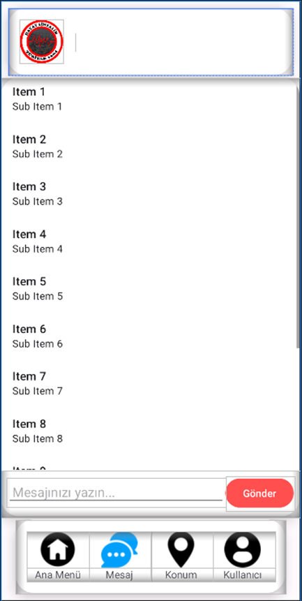 |  | 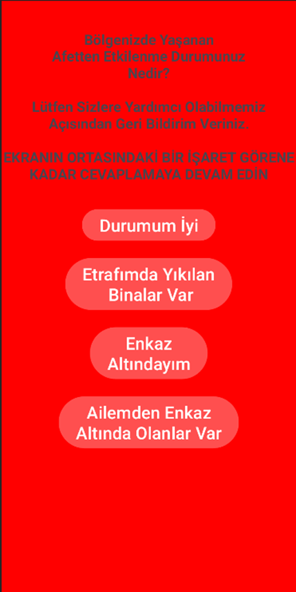 |

| Görsel 7 | Görsel 8 | Görsel 9 |
|----------|----------|----------|
|  | 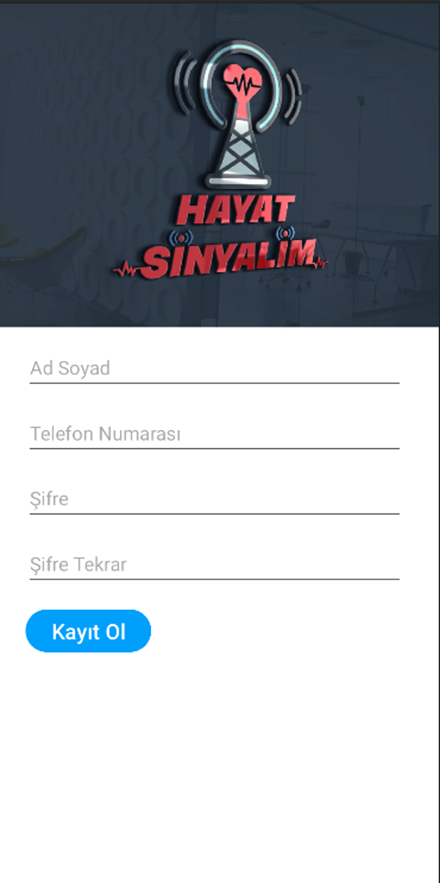 | 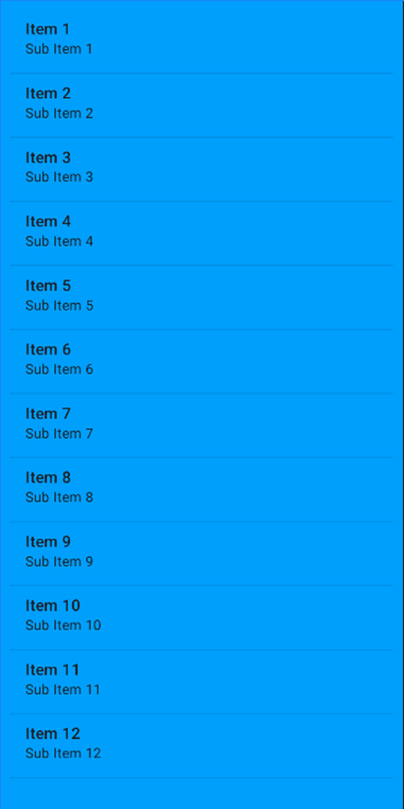 |

| Görsel 10 | Görsel 11 | Görsel 12 |
|-----------|-----------|-----------|
| 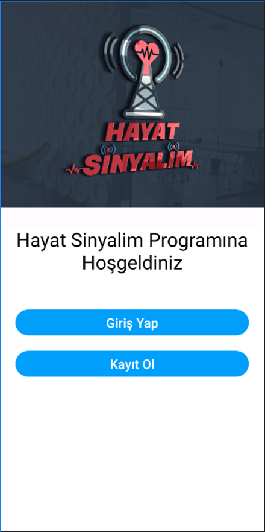 | 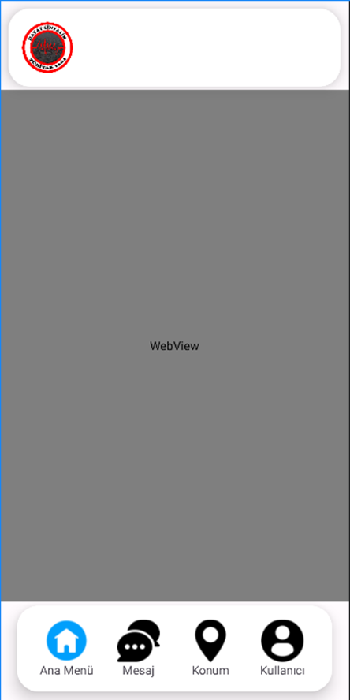 | 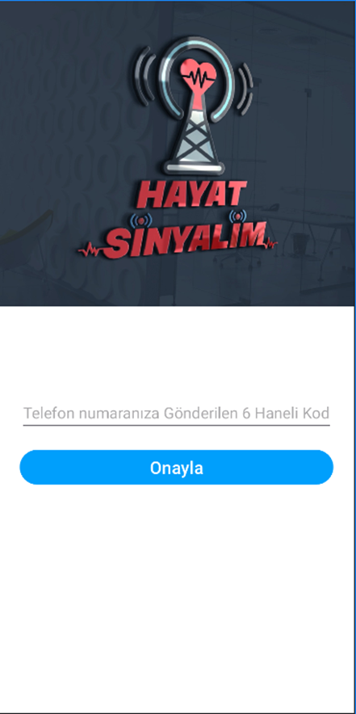 |

| Görsel 13 | Görsel 14 | Görsel 15 |
|-----------|-----------|-----------|
| 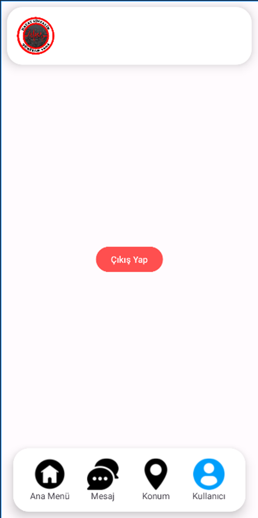 | 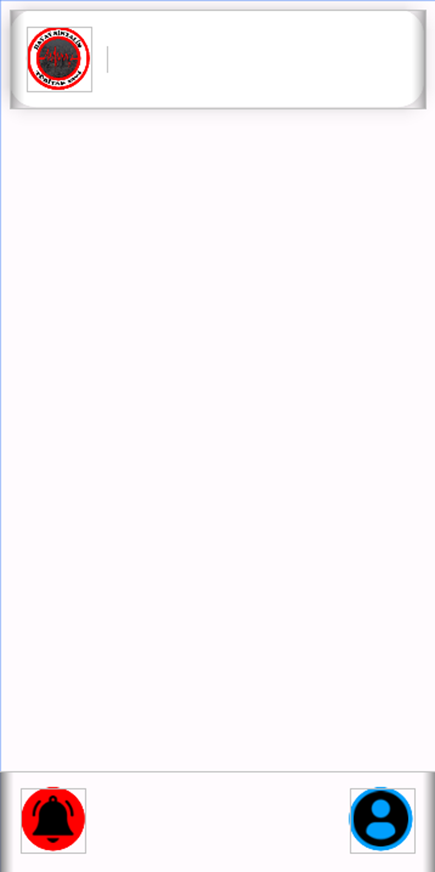 | 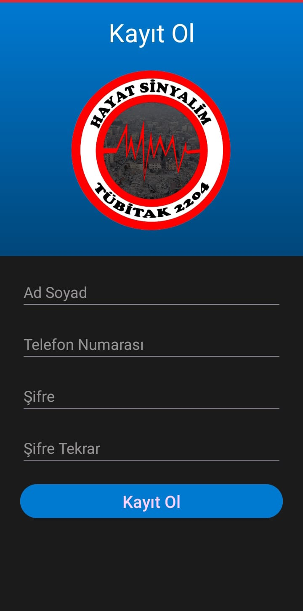 |

| Görsel 16 | Görsel 17 | Görsel 18 |
|-----------|-----------|-----------|
| 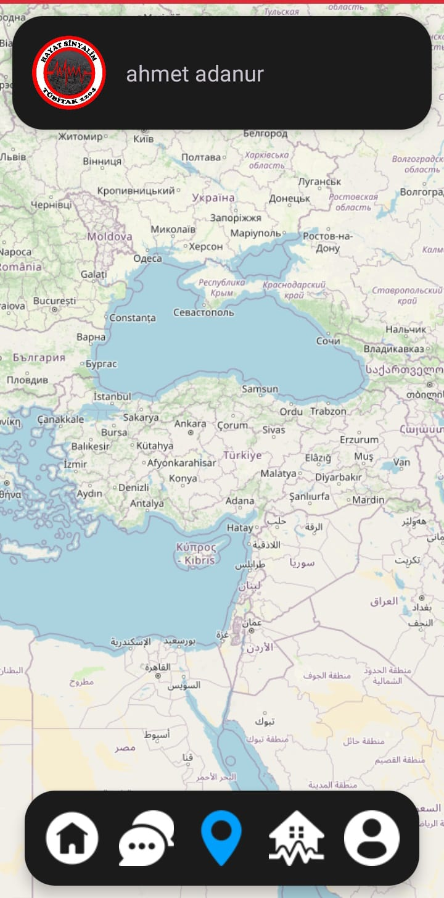 | 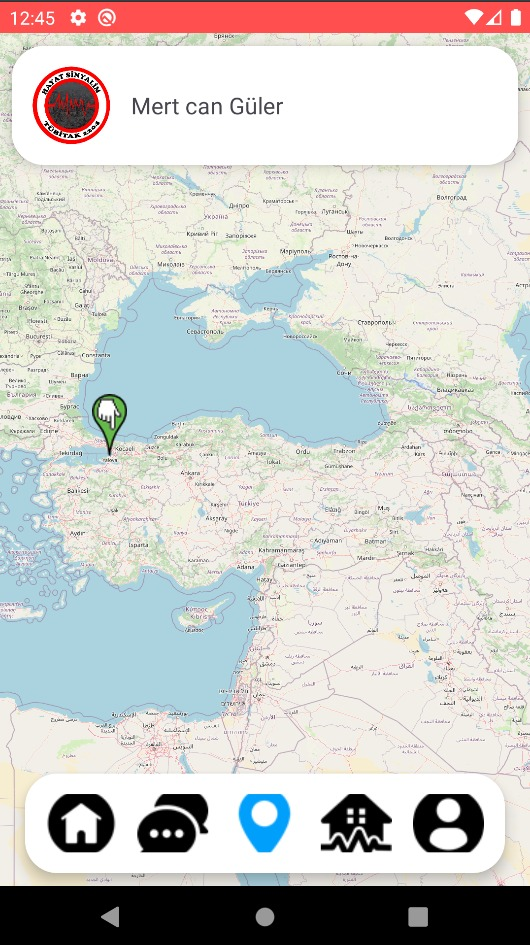 | 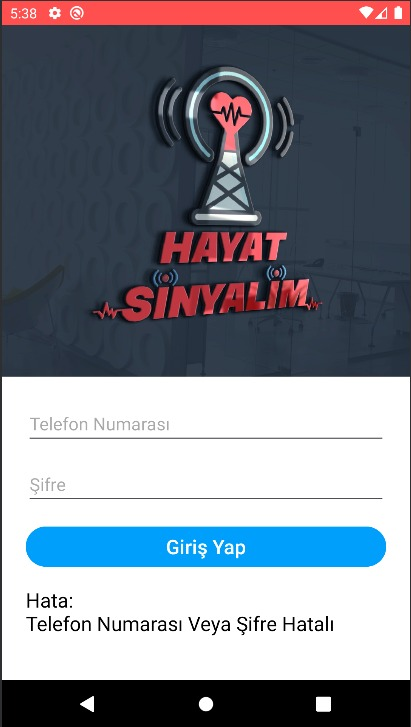 |

| Görsel 19 | Görsel 20 |
|-----------|-----------|
|  | 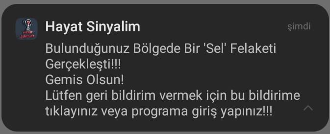 |

